## Time-Series Momentum ML — Research Report

# Research question:

A research pipeline aimed at determining whether features from lagged prices and volumes can predict if an asset's adjusted close will be higher tomorrow than today, before checking if this predictive power can survive as an out-of-sample trading signal.

# Data:

* Source: Yahoo Finance via `yfinance` (auto_adjust=False)
* Tickers used: DIA, EFA, IWM, QQQ, SPY (requested: SPY, QQQ, IWM, DIA, EFA; market ticker: SPY)
* TimeFrame used: 2010-01-01 → 2026-08-31
* Feature Panel: 20,645 rows, 4,129 dates, 2010-03-31 → 2026-08-28
* Up-day base rate (whole panel): 54.46%
* Fields: open/high/low are unadjusted session prices; `close` is split-adjusted only; `adj_close` is split- and dividend-adjusted and drives every return, feature and target; volume is split-adjusted share volume.
* Cleaning: duplicate dates dropped (keep last), rows with missing/non-positive adjusted close dropped, inconsistent high<low and negative volume set to missing, calendar gaps logged but never filled. Details per ticker: `download_manifest.json` in the raw data folder.
* Limitations: Yahoo data are vendor-adjusted and can be revised retroactively; the universe consists of instruments that exist today (survivorship); ETF closes are not perfectly synchronous with the underlying (notably EFA, whose holdings trade in earlier time zones).

# Feature definitions:

| feature | definition |
|---|---|
| ret_1d | AdjClose_t / AdjClose_(t-1) - 1 |
| ret_2d | AdjClose_t / AdjClose_(t-2) - 1 |
| ret_5d | AdjClose_t / AdjClose_(t-5) - 1 |
| ret_10d | AdjClose_t / AdjClose_(t-10) - 1 |
| ret_20d | AdjClose_t / AdjClose_(t-20) - 1 |
| ret_60d | AdjClose_t / AdjClose_(t-60) - 1 |
| vol_5d | std of daily adj-close returns over days t-4..t (annualised x sqrt(252)) |
| vol_10d | std of daily adj-close returns over days t-9..t (annualised x sqrt(252)) |
| vol_20d | std of daily adj-close returns over days t-19..t (annualised x sqrt(252)) |
| vol_60d | std of daily adj-close returns over days t-59..t (annualised x sqrt(252)) |
| dist_ma_5 | AdjClose_t / SMA5_t - 1 (SMA over days t-4..t) |
| dist_ma_20 | AdjClose_t / SMA20_t - 1 (SMA over days t-19..t) |
| dist_ma_50 | AdjClose_t / SMA50_t - 1 (SMA over days t-49..t) |
| ma_spread_5_20 | SMA5_t / SMA20_t - 1 |
| hl_range | (High_t - Low_t) / Close_t  (same-day unadjusted; equals adjusted ratio) |
| oc_return | Close_t / Open_t - 1 (intraday return) |
| volume_pct_change | Volume_t / Volume_(t-1) - 1 |
| volume_rel_ma20 | Volume_t / mean(Volume over days t-19..t) |
| mdd_20d | max drawdown of AdjClose within days t-19..t (<= 0) |
| mdd_60d | max drawdown of AdjClose within days t-59..t (<= 0) |
| mkt_ret_1d | SPY 1-day return, lagged 1 day(s) |
| mkt_ret_5d | SPY 5-day return, lagged 1 day(s) |
| mkt_ret_20d | SPY 20-day return, lagged 1 day(s) |
| mkt_vol_20d | SPY 20-day volatility (annualised x sqrt(252)), lagged 1 day(s) |

# Target definition:

`fwd_ret_t = AdjClose_(t+1) / AdjClose_t − 1`; `target_t = 1 if fwd_ret_t > 0.0 else 0`. Rows whose outcome is not yet observable (the final horizon days) are dropped. The forward return is stored only for evaluation and backtesting and is excluded from the model inputs.

# Train, validation and test methodology:

| name | start | end | n_dates | n_rows |
|---|---|---|---|---|
| train | 2010-03-31 | 2020-01-30 | 2476 | 12380 |
| validation | 2020-02-03 | 2023-05-10 | 824 | 4120 |
| test | 2023-05-12 | 2026-08-28 | 827 | 4135 |

* Splits are by date across all tickers (no shuffling); the last 1 date(s) of train and of validation are purged because their labels depend on prices in the next segment.
* Hyperparameter tuning: grid search on the training split only, with `TimeSeriesSplit` (4 folds, grouped by date, gap = purge) scored by `neg_log_loss`.
* Model selection: the non-baseline model with the best validation `log_loss` (fitted on train). Test data were not used.
* Final test predictions: every model refitted on train + validation with its selected hyperparameters, then scored once on the test split.
* Walk-forward (expanding window): hyperparameters fixed from the tuning step; each model is refitted on all dates before each block and predicts the block. Scope: `full`. This is a robustness view and was not used for selection.

| fold | train_start | train_end | test_start | test_end | train_rows | test_rows |
|---|---|---|---|---|---|---|
| 0 | 2010-03-31 | 2013-04-01 | 2013-04-03 | 2014-04-01 | 3775 | 1260 |
| 1 | 2010-03-31 | 2014-03-31 | 2014-04-02 | 2015-04-01 | 5035 | 1260 |
| 2 | 2010-03-31 | 2015-03-31 | 2015-04-02 | 2016-04-01 | 6295 | 1260 |
| 3 | 2010-03-31 | 2016-03-31 | 2016-04-04 | 2017-03-31 | 7555 | 1260 |
| 4 | 2010-03-31 | 2017-03-30 | 2017-04-03 | 2018-04-03 | 8815 | 1260 |
| 5 | 2010-03-31 | 2018-04-02 | 2018-04-04 | 2019-04-03 | 10075 | 1260 |
| 6 | 2010-03-31 | 2019-04-02 | 2019-04-04 | 2020-04-02 | 11335 | 1260 |
| 7 | 2010-03-31 | 2020-04-01 | 2020-04-03 | 2021-04-05 | 12595 | 1260 |
| 8 | 2010-03-31 | 2021-04-01 | 2021-04-06 | 2022-04-01 | 13855 | 1260 |
| 9 | 2010-03-31 | 2022-03-31 | 2022-04-04 | 2023-04-04 | 15115 | 1260 |
| 10 | 2010-03-31 | 2023-04-03 | 2023-04-05 | 2024-04-05 | 16375 | 1260 |
| 11 | 2010-03-31 | 2024-04-04 | 2024-04-08 | 2025-04-08 | 17635 | 1260 |
| 12 | 2010-03-31 | 2025-04-07 | 2025-04-09 | 2026-04-10 | 18895 | 1260 |
| 13 | 2010-03-31 | 2026-04-09 | 2026-04-13 | 2026-08-28 | 20155 | 485 |

# How I prevented look-ahead bias:

* Every rolling window ends at `t` (trailing, never centred); only positive shifts are used.
* Market (SPY) features are additionally lagged by 1 day(s).
* No imputation or forward-filling of prices; warm-up rows are dropped.
* StandardScaler lives inside the logistic-regression Pipeline, so it is fitted on each training fold only.
* Boundary purging between splits and between CV folds removes overlapping labels.
* Unit tests recompute features on data truncated at `t` and on data with every price after `t` perturbed; row `t` must be identical (`tests/test_features.py`).
* The backtest position for row `t` uses only the probability for row `t` and earns `fwd_ret_t`, realised after the decision.

# Models and hyperparameters used:

| model | estimator | grid size | selected hyperparameters | CV neg_log_loss |
|---|---|---|---|---|
| majority | DummyClassifier | 0 | – | – |
| logreg_none | Pipeline | 0 | – | – |
| logreg_l1 | Pipeline | 5 | C=0.001 | -0.6931 |
| logreg_l2 | Pipeline | 5 | C=0.001 | -0.6929 |
| random_forest | RandomForestClassifier | 24 | max_depth=3, max_features=sqrt, min_samples_leaf=200, n_estimators=400 | -0.6946 |
| xgboost | XGBClassifier | 192 | colsample_bytree=1.0, learning_rate=0.03, max_depth=2, n_estimators=100, reg_alpha=0.1, reg_lambda=1.0, subsample=1.0 | -0.6931 |

Logistic regressions use `class_weight='balanced'` and standardised inputs; the random forest uses `class_weight='balanced_subsample'`; tree models see unscaled inputs. Seed: 42.

# Classification results:

## Validation (models fitted on train) - used for selection:

| model | selected | n | base_rate | accuracy | balanced_accuracy | precision | recall | f1 | roc_auc | log_loss | brier | acc_pvalue_vs_majority |
|---|---|---|---|---|---|---|---|---|---|---|---|---|
| majority |  | 4120 | 0.5306 | 0.5306 | 0.5000 | 0.5306 | 1.0000 | 0.6933 | 0.5000 | 0.6918 | 0.2493 | 0.5064 |
| logreg_none |  | 4120 | 0.5306 | 0.5053 | 0.5043 | 0.5348 | 0.5206 | 0.5276 | 0.5017 | 0.6985 | 0.2526 | 0.9994 |
| logreg_l1 | ✓ | 4120 | 0.5306 | 0.5306 | 0.5000 | 0.5306 | 1.0000 | 0.6933 | 0.5000 | 0.6931 | 0.2500 | 0.5064 |
| logreg_l2 |  | 4120 | 0.5306 | 0.4925 | 0.4974 | 0.5274 | 0.4177 | 0.4662 | 0.5015 | 0.6943 | 0.2506 | 1.0000 |
| random_forest |  | 4120 | 0.5306 | 0.4888 | 0.4875 | 0.5187 | 0.5087 | 0.5136 | 0.4858 | 0.6946 | 0.2507 | 1.0000 |
| xgboost |  | 4120 | 0.5306 | 0.5303 | 0.5065 | 0.5342 | 0.8966 | 0.6695 | 0.4797 | 0.6956 | 0.2511 | 0.5188 |

## Test (untouched until now; models refitted on train+validation):

| model | selected | n | base_rate | accuracy | balanced_accuracy | precision | recall | f1 | roc_auc | log_loss | brier | acc_pvalue_vs_majority |
|---|---|---|---|---|---|---|---|---|---|---|---|---|
| majority |  | 4135 | 0.5531 | 0.5531 | 0.5000 | 0.5531 | 1.0000 | 0.7122 | 0.5000 | 0.6877 | 0.2473 | 0.5065 |
| logreg_none |  | 4135 | 0.5531 | 0.4912 | 0.4927 | 0.5457 | 0.4779 | 0.5096 | 0.4937 | 0.6955 | 0.2512 | 1.0000 |
| logreg_l1 | ✓ | 4135 | 0.5531 | 0.5531 | 0.5000 | 0.5531 | 1.0000 | 0.7122 | 0.5000 | 0.6931 | 0.2500 | 0.5065 |
| logreg_l2 |  | 4135 | 0.5531 | 0.4936 | 0.4934 | 0.5466 | 0.4950 | 0.5195 | 0.4993 | 0.6935 | 0.2502 | 1.0000 |
| random_forest |  | 4135 | 0.5531 | 0.5173 | 0.5001 | 0.5531 | 0.6624 | 0.6029 | 0.5038 | 0.6932 | 0.2500 | 1.0000 |
| xgboost |  | 4135 | 0.5531 | 0.5473 | 0.4978 | 0.5519 | 0.9641 | 0.7020 | 0.5048 | 0.6886 | 0.2477 | 0.7783 |

## Walk-forward out-of-sample (concatenated blocks):

| model | selected | n | base_rate | accuracy | balanced_accuracy | precision | recall | f1 | roc_auc | log_loss | brier | acc_pvalue_vs_majority |
|---|---|---|---|---|---|---|---|---|---|---|---|---|
| majority |  | 16865 | 0.5462 | 0.5462 | 0.5000 | 0.5462 | 1.0000 | 0.7065 | 0.4830 | 0.6891 | 0.2480 | 0.5032 |
| logreg_none |  | 16865 | 0.5462 | 0.4983 | 0.4970 | 0.5432 | 0.5117 | 0.5270 | 0.4955 | 0.6985 | 0.2517 | 1.0000 |
| logreg_l1 | ✓ | 16865 | 0.5462 | 0.5462 | 0.5000 | 0.5462 | 1.0000 | 0.7065 | 0.5000 | 0.6931 | 0.2500 | 0.5032 |
| logreg_l2 |  | 16865 | 0.5462 | 0.4932 | 0.4924 | 0.5387 | 0.5007 | 0.5190 | 0.4937 | 0.6939 | 0.2504 | 1.0000 |
| random_forest |  | 16865 | 0.5462 | 0.4952 | 0.4913 | 0.5382 | 0.5329 | 0.5356 | 0.4882 | 0.6943 | 0.2506 | 1.0000 |
| xgboost |  | 16865 | 0.5462 | 0.5387 | 0.4992 | 0.5457 | 0.9276 | 0.6872 | 0.4901 | 0.6914 | 0.2491 | 0.9738 |

Selected model: logreg_l1 (validation log_loss = 0.69315; better than the majority baseline on validation: no).

`acc_pvalue_vs_majority` is a one-sided binomial test treating rows as independent; same-day rows across correlated ETFs are not independent, so these p-values are optimistic, and no correction for the number of models has been applied.

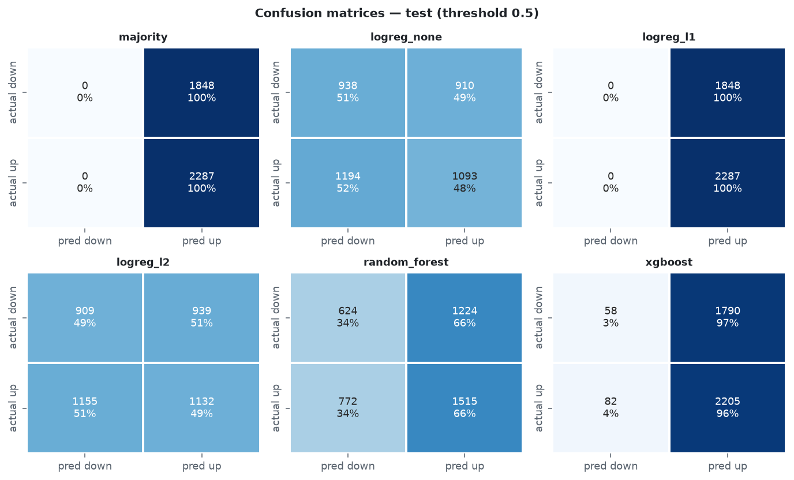
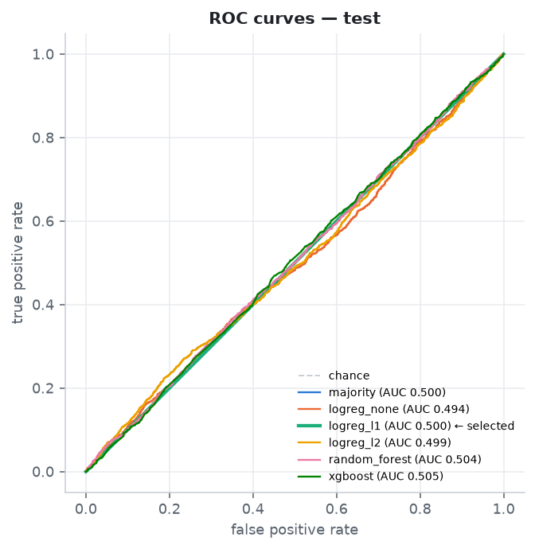
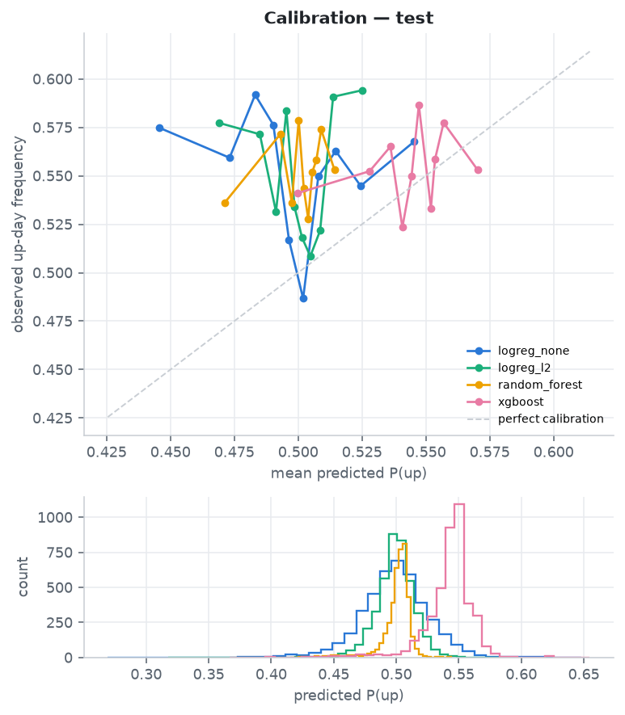
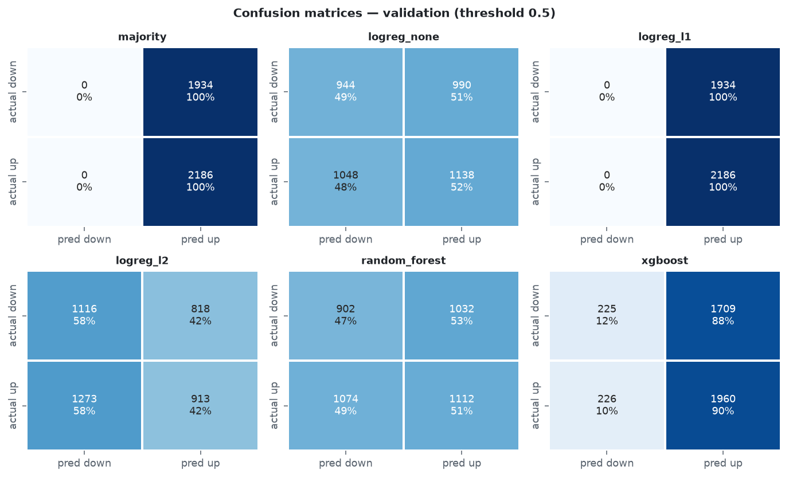
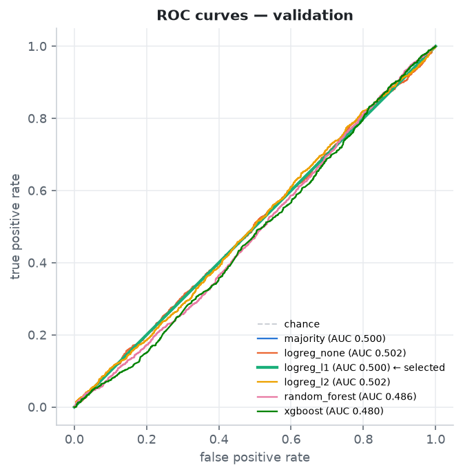
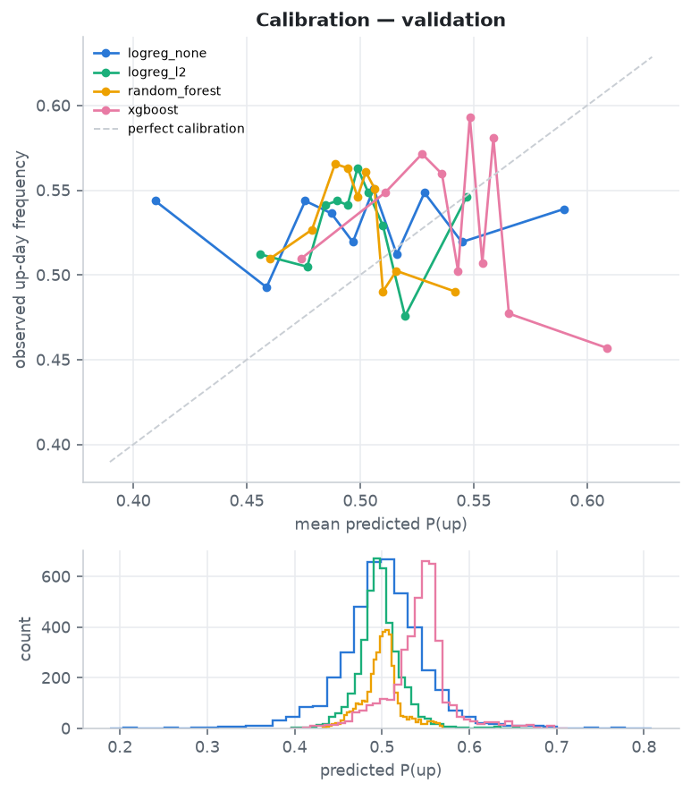

# Backtest results:

Rules: long when P(up) ≥ 0.5, otherwise cash; 5.0 bp per one-way trade; execution lag 0 (0 = position taken at the close of the signal day, an idealised market-on-close assumption); equal-weight sleeves per ticker; cash earns 0; Sharpe uses rf = 0.00%. All figures are net of costs.

## Test period:

| strategy | kind | cumulative_return | annualised_return | annualised_volatility | sharpe | max_drawdown | calmar | hit_rate | avg_trade_return | n_trades | annual_turnover | avg_exposure | total_cost |
|---|---|---|---|---|---|---|---|---|---|---|---|---|---|
| majority | model | 86.23% | 20.86% | 15.28% | 1.316 | -18.27% | 1.142 | 55.14% | 85.62% | 5 | 0.305 | 100.00% | 0.05% |
| logreg_none | model | 14.45% | 4.20% | 9.77% | 0.470 | -11.99% | 0.350 | 52.71% | 0.09% | 812 | 98.789 | 48.44% | 16.21% |
| logreg_l1 | model | 86.23% | 20.86% | 15.28% | 1.316 | -18.27% | 1.142 | 55.14% | 85.62% | 5 | 0.305 | 100.00% | 0.05% |
| logreg_l2 | model | 19.67% | 5.62% | 11.43% | 0.535 | -12.89% | 0.436 | 51.79% | 0.11% | 923 | 112.196 | 50.08% | 18.41% |
| random_forest | model | 33.17% | 9.12% | 12.77% | 0.747 | -16.43% | 0.555 | 53.95% | 0.24% | 619 | 75.143 | 66.24% | 12.33% |
| xgboost | model | 73.34% | 18.25% | 15.04% | 1.190 | -18.27% | 0.999 | 55.03% | 3.99% | 74 | 8.715 | 96.61% | 1.43% |
| always_long | benchmark | 86.23% | 20.86% | 15.28% | 1.316 | -18.27% | 1.142 | 55.14% | 85.62% | 5 | 0.305 | 100.00% | 0.05% |
| ma_rule_50d | benchmark | 44.15% | 11.79% | 10.16% | 1.148 | -8.00% | 1.474 | 54.13% | 1.45% | 135 | 16.211 | 74.12% | 2.66% |
| buy_and_hold | benchmark | 85.62% | 20.74% | 15.42% | 1.299 | -18.55% | 1.118 | 54.90% | – | 5 | 0.305 | 100.00% | 0.05% |

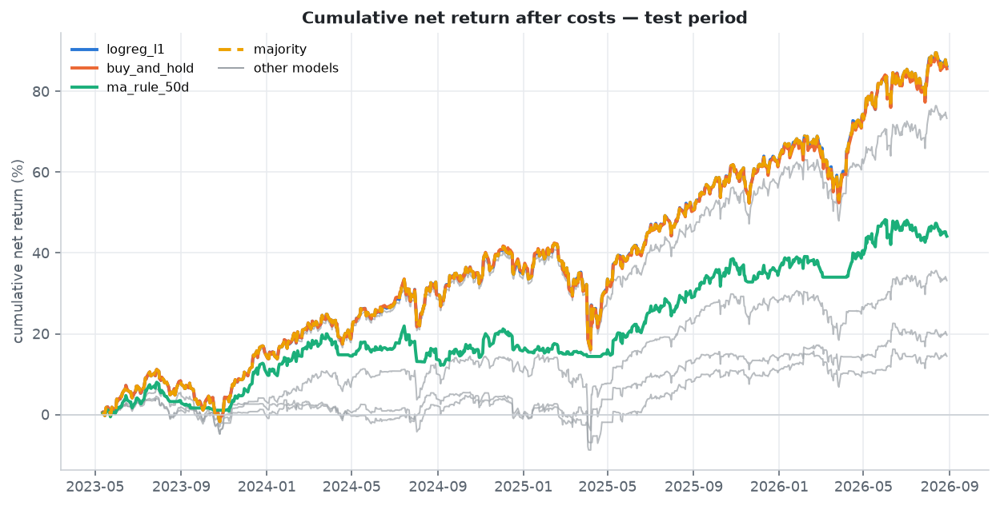
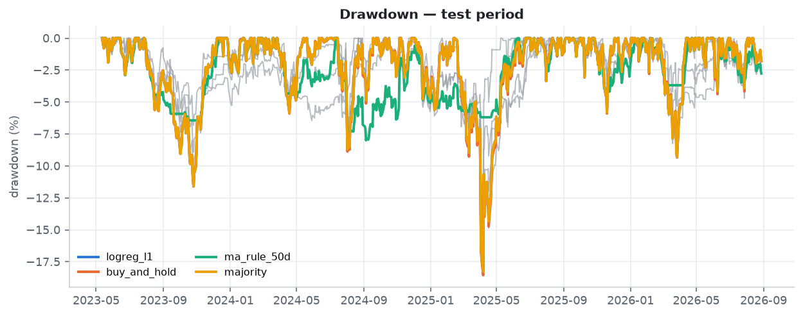
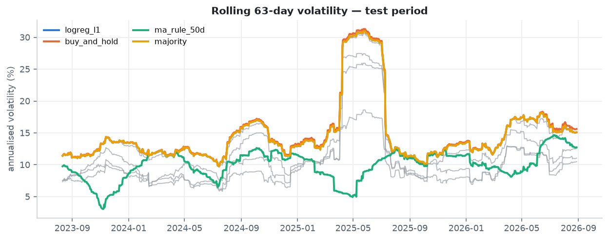

## Sensitivity of the selected model (logreg_l1) on the test period:

This is only reported for transparency, none of these settings were chosen using the test data.

| execution_lag | cost_bps | annualised_return | sharpe | max_drawdown | annual_turnover | total_cost |
|---|---|---|---|---|---|---|
| 0 | 0.000 | 20.88% | 1.317 | -18.27% | 0.305 | 0.00% |
| 0 | 2.000 | 20.87% | 1.317 | -18.27% | 0.305 | 0.02% |
| 0 | 5.000 | 20.86% | 1.316 | -18.27% | 0.305 | 0.05% |
| 0 | 10.000 | 20.84% | 1.316 | -18.27% | 0.305 | 0.10% |
| 0 | 20.000 | 20.81% | 1.314 | -18.27% | 0.305 | 0.20% |
| 1 | 0.000 | 20.66% | 1.306 | -18.27% | 0.305 | 0.00% |
| 1 | 2.000 | 20.65% | 1.305 | -18.27% | 0.305 | 0.02% |
| 1 | 5.000 | 20.64% | 1.304 | -18.27% | 0.305 | 0.05% |
| 1 | 10.000 | 20.62% | 1.303 | -18.27% | 0.305 | 0.10% |
| 1 | 20.000 | 20.58% | 1.301 | -18.27% | 0.305 | 0.20% |

## Per-ticker test results (selected model vs. holding the ticker):

| ticker | strategy | annualised_return | annualised_volatility | sharpe | max_drawdown | hit_rate | n_trades |
|---|---|---|---|---|---|---|---|
| DIA | logreg_l1 | 17.23% | 13.35% | 1.257 | -15.95% | 55.99% | 1 |
| DIA | hold_ticker | 17.23% | 13.35% | 1.257 | -15.95% | 55.99% | 1 |
| EFA | logreg_l1 | 16.33% | 15.10% | 1.077 | -14.05% | 53.45% | 1 |
| EFA | hold_ticker | 16.33% | 15.10% | 1.077 | -14.05% | 53.45% | 1 |
| IWM | logreg_l1 | 18.94% | 20.84% | 0.936 | -27.50% | 52.96% | 1 |
| IWM | hold_ticker | 18.94% | 20.84% | 0.936 | -27.50% | 52.96% | 1 |
| QQQ | logreg_l1 | 27.96% | 20.16% | 1.323 | -22.77% | 57.19% | 1 |
| QQQ | hold_ticker | 27.96% | 20.16% | 1.323 | -22.77% | 57.19% | 1 |
| SPY | logreg_l1 | 22.39% | 14.97% | 1.425 | -18.76% | 56.95% | 1 |
| SPY | hold_ticker | 22.39% | 14.97% | 1.425 | -18.76% | 56.95% | 1 |

## Walk-forward period:

| strategy | kind | cumulative_return | annualised_return | annualised_volatility | sharpe | max_drawdown | calmar | hit_rate | avg_trade_return | n_trades | annual_turnover | avg_exposure | total_cost |
|---|---|---|---|---|---|---|---|---|---|---|---|---|---|
| majority | model | 433.52% | 13.33% | 17.26% | 0.812 | -34.34% | 0.388 | 54.76% | 484.87% | 5 | 0.075 | 100.00% | 0.05% |
| logreg_none | model | 63.31% | 3.73% | 12.70% | 0.352 | -23.61% | 0.158 | 52.03% | 0.09% | 3132 | 93.523 | 51.44% | 62.59% |
| logreg_l1 | model | 433.52% | 13.33% | 17.26% | 0.812 | -34.34% | 0.388 | 54.76% | 484.87% | 5 | 0.075 | 100.00% | 0.05% |
| logreg_l2 | model | 39.09% | 2.50% | 13.00% | 0.254 | -26.96% | 0.093 | 51.75% | 0.06% | 3423 | 102.220 | 50.76% | 68.41% |
| random_forest | model | 36.80% | 2.37% | 13.98% | 0.238 | -38.16% | 0.062 | 52.74% | 0.08% | 2433 | 72.649 | 54.08% | 48.62% |
| xgboost | model | 303.34% | 10.98% | 16.42% | 0.717 | -34.23% | 0.321 | 54.22% | 1.02% | 740 | 22.040 | 92.83% | 14.75% |
| always_long | benchmark | 433.52% | 13.33% | 17.26% | 0.812 | -34.34% | 0.388 | 54.76% | 484.87% | 5 | 0.075 | 100.00% | 0.05% |
| ma_rule_50d | benchmark | 106.38% | 5.56% | 9.94% | 0.595 | -16.87% | 0.330 | 54.19% | 0.68% | 594 | 17.692 | 70.09% | 11.84% |
| buy_and_hold | benchmark | 484.87% | 14.11% | 17.71% | 0.834 | -33.48% | 0.421 | 54.91% | – | 5 | 0.075 | 100.00% | 0.05% |

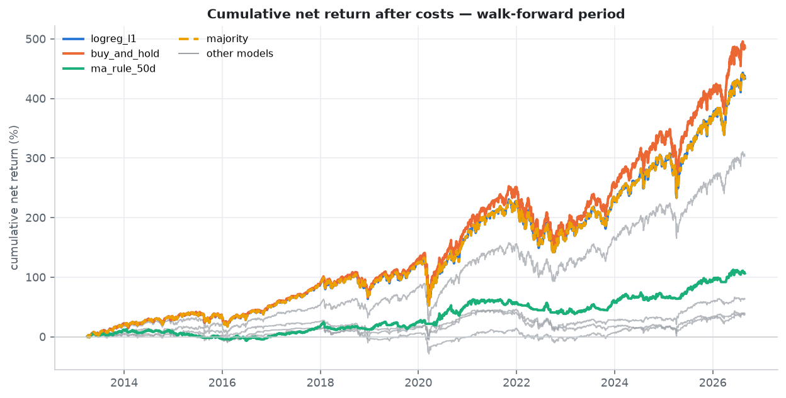
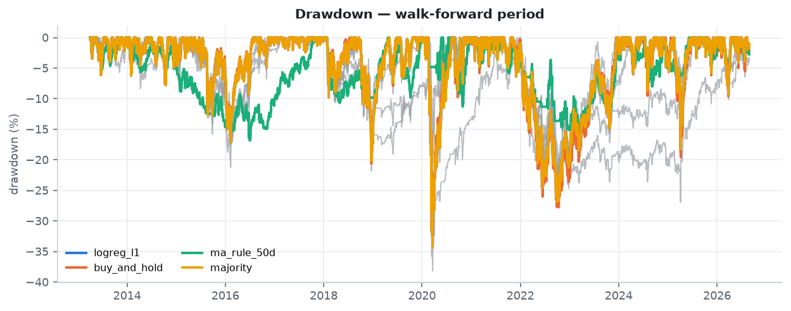
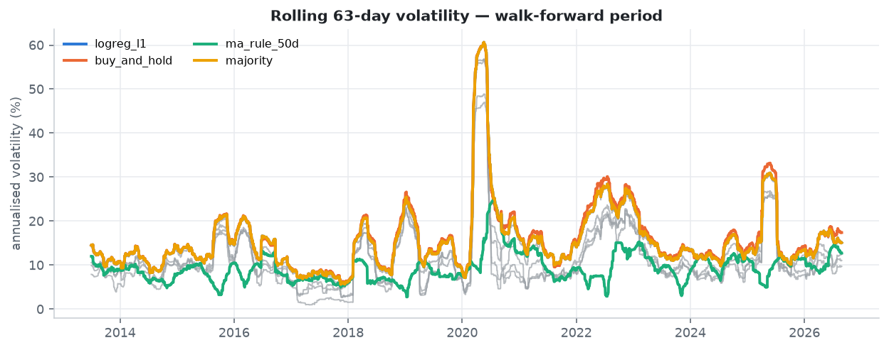

# Benchmark comparison:

* vs buy-and-hold: Sharpe 1.32 vs 1.30; annualised return 20.86% vs 20.74%; max drawdown -18.27% vs -18.55%.
* vs always-long: Sharpe 1.32 vs 1.32; annualised return 20.86% vs 20.86%; max drawdown -18.27% vs -18.27%.
* vs ma_rule_50d rule: Sharpe 1.32 vs 1.15; annualised return 20.86% vs 11.79%; max drawdown -18.27% vs -8.00%.
* vs majority-class model: Sharpe 1.32 vs 1.32; annualised return 20.86% vs 20.86%; max drawdown -18.27% vs -18.27%.

The majority-class model predicts the training set's more frequent class every day; when that class is 'up' its strategy is identical to always-long.

Warning: the selected model (logreg_l1) outputs a constant P(up) = 0.5000 on every test row and is long 100% of the time, so the comparisons above set a passive benchmark against itself rather than testing a signal. See the conclusions below.

# Feature importance:

Native importances come from models fitted on the training split; permutation importance is the drop in validation `roc_auc` when a feature is shuffled (mean ± std over repeats).

coef_logreg_l1 (top 8):

| feature | coef_per_sd | abs_coef_per_sd | coef_raw_units | feature_sd |
|---|---|---|---|---|
| ret_1d | 0.0000 | 0.0000 | 0.0000 | 0.0105 |
| ret_2d | 0.0000 | 0.0000 | 0.0000 | 0.0145 |
| ret_5d | 0.0000 | 0.0000 | 0.0000 | 0.0223 |
| ret_10d | 0.0000 | 0.0000 | 0.0000 | 0.0296 |
| ret_20d | 0.0000 | 0.0000 | 0.0000 | 0.0400 |
| ret_60d | 0.0000 | 0.0000 | 0.0000 | 0.0632 |
| vol_5d | 0.0000 | 0.0000 | 0.0000 | 0.0941 |
| vol_10d | 0.0000 | 0.0000 | 0.0000 | 0.0848 |

coef_logreg_l2 (top 8):

| feature | coef_per_sd | abs_coef_per_sd | coef_raw_units | feature_sd |
|---|---|---|---|---|
| vol_20d | -0.0351 | 0.0351 | -0.4563 | 0.0770 |
| hl_range | -0.0304 | 0.0304 | -3.9415 | 0.0077 |
| mdd_20d | -0.0279 | 0.0279 | -0.9640 | 0.0289 |
| oc_return | -0.0274 | 0.0274 | -3.4380 | 0.0080 |
| mkt_ret_20d | -0.0245 | 0.0245 | -0.7064 | 0.0346 |
| ret_1d | -0.0228 | 0.0228 | -2.1733 | 0.0105 |
| vol_10d | 0.0224 | 0.0224 | 0.2638 | 0.0848 |
| ret_5d | -0.0203 | 0.0203 | -0.9105 | 0.0223 |

coef_logreg_none (top 8):

| feature | coef_per_sd | abs_coef_per_sd | coef_raw_units | feature_sd |
|---|---|---|---|---|
| vol_20d | -0.3613 | 0.3613 | -4.6949 | 0.0770 |
| mdd_20d | -0.1992 | 0.1992 | -6.8911 | 0.0289 |
| vol_10d | 0.1793 | 0.1793 | 2.1145 | 0.0848 |
| volume_pct_change | -0.1376 | 0.1376 | -0.0005 | 302.9019 |
| dist_ma_20 | 0.1301 | 0.1301 | 5.7018 | 0.0228 |
| ret_5d | -0.1250 | 0.1250 | -5.5935 | 0.0223 |
| ret_1d | -0.1245 | 0.1245 | -11.8564 | 0.0105 |
| ma_spread_5_20 | 0.0997 | 0.0997 | 5.6329 | 0.0177 |

gain_xgboost (top 8):

| feature | gain | split_count | importance |
|---|---|---|---|
| ret_5d | 15.8737 | 4.0000 | 0.0734 |
| vol_5d | 14.6465 | 12.0000 | 0.0677 |
| mdd_20d | 14.6121 | 4.0000 | 0.0675 |
| mkt_vol_20d | 13.8267 | 78.0000 | 0.0639 |
| oc_return | 13.3194 | 15.0000 | 0.0616 |
| ret_1d | 13.2657 | 23.0000 | 0.0613 |
| mkt_ret_5d | 11.6296 | 41.0000 | 0.0537 |
| mkt_ret_20d | 11.0064 | 20.0000 | 0.0509 |

impurity_random_forest (top 8):

| feature | importance |
|---|---|
| mkt_ret_5d | 0.1130 |
| mkt_vol_20d | 0.0734 |
| ret_1d | 0.0722 |
| dist_ma_20 | 0.0650 |
| mkt_ret_1d | 0.0620 |
| ret_60d | 0.0613 |
| oc_return | 0.0576 |
| mkt_ret_20d | 0.0533 |

Permutation importance for logreg_l1 (top 10):

| feature | importance_mean | importance_std |
|---|---|---|
| ret_1d | 0.00000 | 0.00000 |
| ret_2d | 0.00000 | 0.00000 |
| ret_5d | 0.00000 | 0.00000 |
| ret_10d | 0.00000 | 0.00000 |
| ret_20d | 0.00000 | 0.00000 |
| ret_60d | 0.00000 | 0.00000 |
| vol_5d | 0.00000 | 0.00000 |
| vol_10d | 0.00000 | 0.00000 |
| vol_20d | 0.00000 | 0.00000 |
| vol_60d | 0.00000 | 0.00000 |

0 of 24 features have a permutation effect larger than twice its repeat-to-repeat standard deviation for the selected model. Importance measures describe what a model uses, not causal effects, and they are unstable when signal is weak and features are highly correlated (e.g. the 5-day return, 5-day MA distance and 5/20 MA spread overlap heavily).

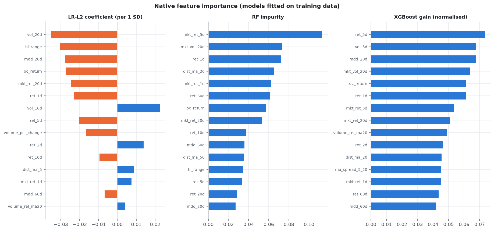
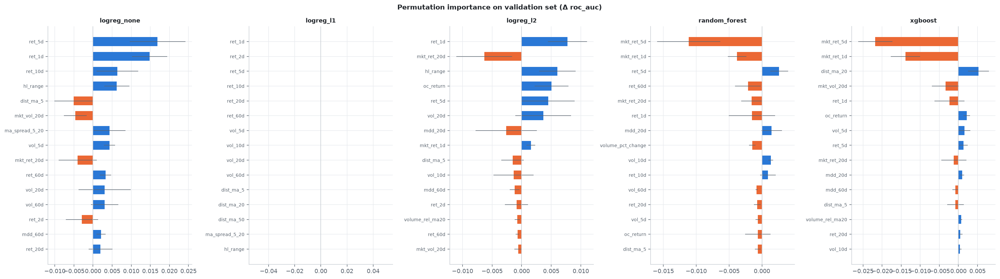

# Some assumptions and limitations of the project:

* Survivorship bias: the universe is chosen today from instruments that still exist and are liquid; individual stocks added via config inherit this bias more severely.
* Transaction costs: a flat bp cost ignores spreads that widen in stress, market impact, borrow costs for shorts, taxes and the price difference between the signal close and an achievable fill. Daily strategies are very cost-sensitive (see the sensitivity table).
* Execution timing: lag 0 assumes trading at the same close that generated the signal, which is not strictly achievable; lag 1 is shown as a conservative alternative.
* Non-stationarity and regime change: relationships between momentum features and next-day returns drift over time (rate regimes, volatility regimes, market structure); a single test window may be unrepresentative.
* Multiple testing: several model families × hyperparameter grids × feature choices were tried. Even with a clean test set, the best of many strategies is biased upward; the binomial p-values and Sharpe t-stats are uncorrected and assume independence.
* Prediction accuracy ≠ economic value: a model can beat 50% accuracy by predicting 'up' in a rising market, or have AUC > 0.5 while its errors fall on large-move days. Only cost-adjusted, risk-adjusted returns relative to simple benchmarks measure value.
* Cross-sectional dependence: the ETFs are highly correlated, so the effective sample is much smaller than the row count.
* Data quality: vendor adjustments and revisions; no point-in-time guarantees.

# Conclusions:

* On the unseen test period the selected model (logreg_l1) achieved accuracy 0.553 against an up-day base rate of 0.553, ROC-AUC 0.500 and log loss 0.6931.
* The selected model is degenerate and is not a trading signal. logreg_l1 was chosen by validation log loss, but its regularisation shrank 24 of 24 coefficients to zero, so it outputs the same probability (P(up) = 0.5000) for every row and ignores the features entirely. It is long 100% of the time, and its daily returns are identical to the always-long benchmark. That value sits exactly on the trading threshold (0.50), so the position is decided purely by the `P ≥ threshold` tie-break; a threshold an infinitesimal amount higher would have kept it in cash every day instead.
* Why the selection procedure picked it: a constant 0.5 forecast scores log loss ln 2 ≈ 0.6931 by construction (validation: 0.6931), and every model that actually used the features scored worse on validation, so the features made probabilistic forecasts worse than a coin flip. Choosing the 'least bad' model then rewards the model that switched itself off. The correct reading of this selection result is "no model", not a win for logreg_l1; its test ROC-AUC of 0.500 says the same.
* After 5.0 bp costs its net Sharpe was 1.32 versus 1.30 for buy-and-hold and 1.32 for always-long (1.30 with a one-day execution lag).
* That Sharpe is the market's, not the model's: the small gap to buy-and-hold comes only from always-long rebalancing to equal weights daily while buy-and-hold lets weights drift (daily active-return t-stat vs buy-and-hold 0.30). It is not evidence that the model beats buy-and-hold.
* The best model that actually uses the features (logreg_l2, validation log loss 0.6943) is the honest test of the research question. On the test period it had ROC-AUC 0.499, net Sharpe 0.54 vs 1.32 for the best passive benchmark, and was long 50% of the time, and it did not beat the passive benchmarks.
* No model beat the majority-class baseline on validation log loss. The features carry little or no usable probabilistic information about next-day direction in this sample, which is consistent with the weak-form efficiency of liquid index ETFs.
* Any apparent edge should be treated as a hypothesis for further testing (new periods, more assets, realistic execution), not as a trading recommendation.

---

_Generated by `momentum_ml.evaluate` from config `config.yaml`; seed 42; package versions: {'python': '3.13.15', 'pandas': '3.0.6', 'numpy': '2.5.3', 'scikit-learn': '1.9.1', 'xgboost_available': True, 'xgboost': '3.4.1'}._
